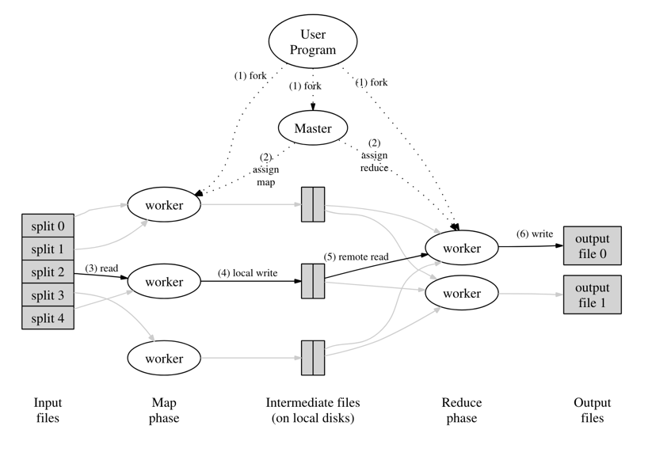
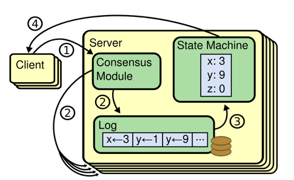
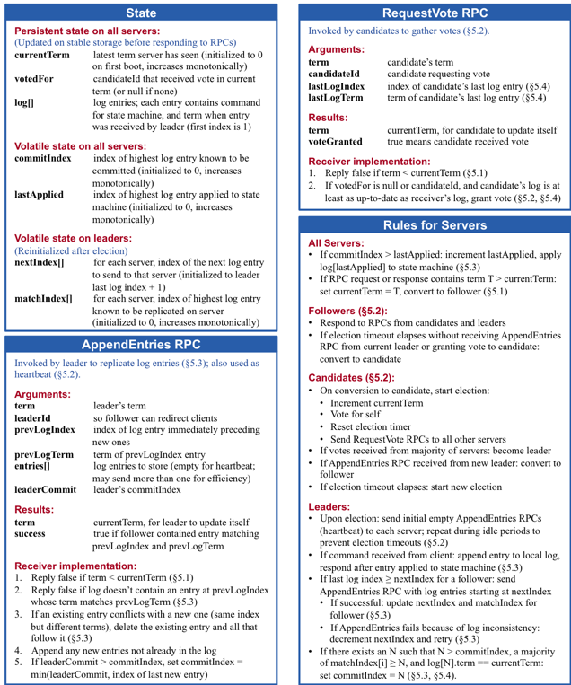
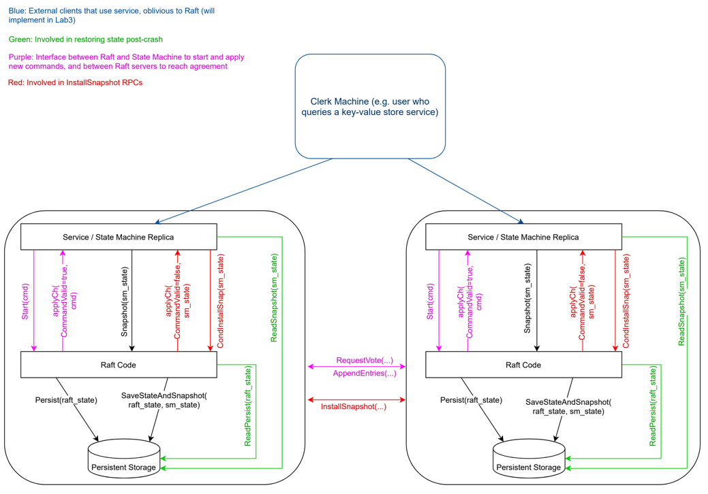
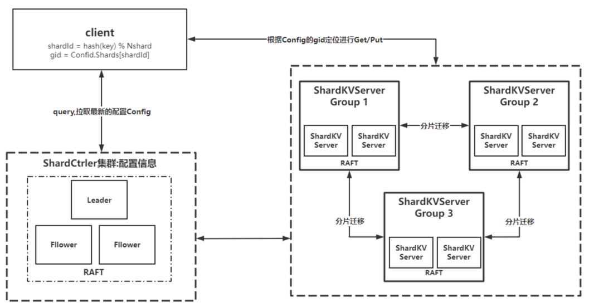

# 分布式KV系统 
## Lab1 MapReduce
Implement a simple MapReduce framework based on the MapReduce paper.The 'mrapps' directory is where user programs for map and reduce are stored.
The 'mr' directory contains the implementation code for MapReduce.  
The master node is responsible for distributing map and reduce tasks to worker nodes. Worker nodes receive the tasks and proceed to complete the map or reduce tasks.
The output of map tasks is written to a shared location, such as GFS (Google File System) or similar storage.
Reduce tasks retrieve the intermediate results, complete the reduce task, and write the results to the output files.

## Lab2 KVServer
building a key/value server for a single machine that ensures that each operation is executed **exactly once** despite network failures and that the operations are **linearizable**.  
The 'kvsrv' directory contains the implementation code for KVserver and client.This lab is a transition from Lab 3 to Lab 4. 
The server provides three RPC interfaces: Get, Put, and Append.

## Lab3 Raft
Raft is a consensus algorithm designed for distributed systems. It provides a reliable and fault-tolerant approach to achieve consensus among a group of nodes in a network. 
the lab is to implement Raft, a distributed consensus algorithm, including **leader election**, **log replication**, **crash recovery** and **log compaction**.
For more details, please refer to the paper [extended Raft paper](https://pdos.csail.mit.edu/6.824/papers/raft-extended.pdf) The 'raft' directory contains the implementation code for raft.  
Raft adopts the approach of replicating the state machine to synchronize data.
  
The RPC interfaces for leader election and log append in Raft are as follows:

The RPC interfaces for snapshot implementation in Raft are as follows:

## Lab4 KVRaft
In this lab, building a fault-tolerant key/value storage service using your Raft library from Lab 3 in one group.
The kvserver ensures that operations are **executed only once**, achieving **strong consistency** and **linearizability**, even in cases of poor network conditions or when certain nodes are down.  
This lab is similar to Lab 2, but additionally use Raft for replication. It is easy for a single machine to provide linearizability, but **how can linearizability be achieved across multiple machines**?  
The 'kvraft' directory contains the implement for fault-tolerant key/value storage service.  
The following are the RPC interfaces provided externally:  
`Put(key, value)`: replaces the value for a particular key in the database  
`Append(key, arg)`: appends arg to key's value (treating the existing value as an empty string if the key is non-existent)  
`Get(key)`: fetches the current value of the key (returning the empty string for non-existent keys)  
 
The following diagram demonstrates how Raft interacts with the upper-level application:  

## Lab5 ShardKV
sharded key/value store will have two main components. First,First, a set of replica groups. Each replica group is responsible for a subset of the shards, using Raft replication.
The second component is the "shard controller". The shard controller decides which replica group should serve each shard;
There is a single shard controller for the whole system, implemented as a fault-tolerant service using Raft.  
The 'shardctrler' directory contains the implementation of the shard controller, while the 'shardkv' directory contains the implementation of the KV service

The following diagram illustrates the interaction between the client, shard controller, and KV group.  
